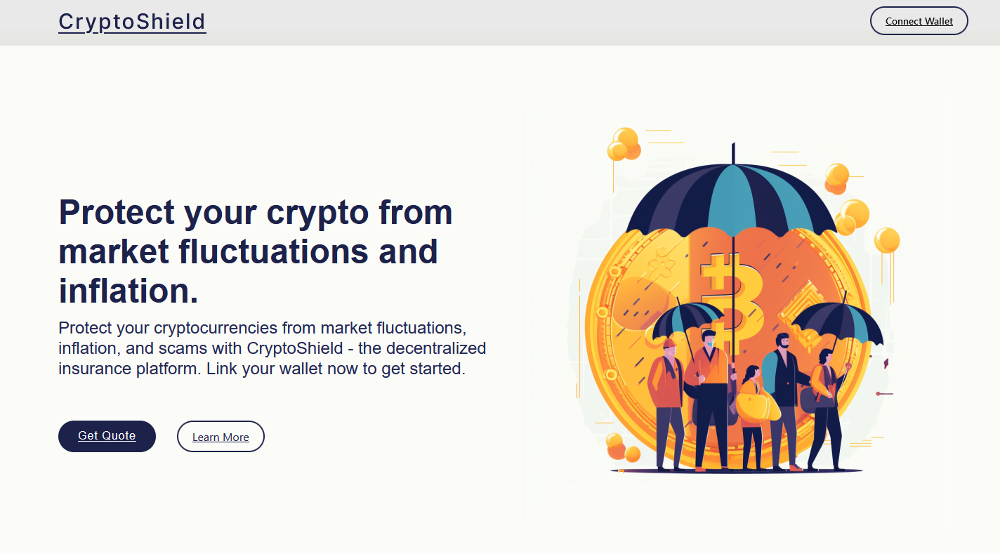
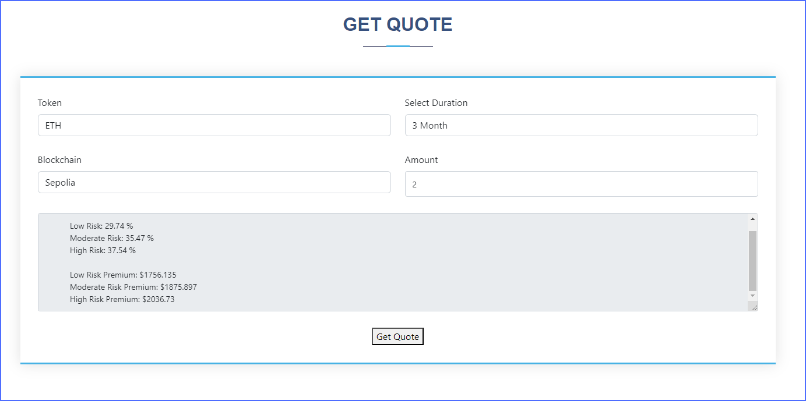

# CryptoShield

- ***CryptoShield safeguards your investments from the impact of price fluctuations.***

- ***We trained Machine Learning Model to predict Eth price till the end of the year to estimate a price fluctuation risk, and used Chainlink's Price feed to compare predicted versus actual***

- ***Choose from three distinct protection tiers with CryptoShield, each offering coverage for 3, 6, or 9 months.***

- ***When you withdraw your ETH, you'll enjoy coverage up to the tier of your choosing, ensuring protection in case of price drops.***

### Packages used to build CryptoShield

- **Machine Learning Models to predict ETH prices**

    - [TensorFlow](https://www.tensorflow.org/)
    - [StatsModels](https://www.statsmodels.org/stable/index.html)
    - [scikit-learn](https://scikit-learn.org/stable/)
    - [Pandas](https://pandas.pydata.org/)
    - [NumPy](https://numpy.org/)
    - [Matplotlib](https://matplotlib.org/)

- **APIs**

    - [Next.js](https://nextjs.org/)
    - [Alpha Vantage API](https://www.alphavantage.co/documentation/)
    - [U.S. Bureau of Labor Statistics API](https://www.bls.gov/developers/home.htm)

- **Connecting Blockchain to real world data**

    - [Chainlink Functions](https://docs.chain.link/chainlink-functions)
    - [Chainlink Data Feeds](https://data.chain.link/)
    - [Chainlink Keepers](https://docs.chain.link/chainlink-automation/introduction)

-  [You can find ETH price predications here.](./coins/ETH/predictions)

## How to interact with the application

- Connect your Metamask to Sepolia.

- Proceed to get Quote.

- Currently it's only ETH as coin and Sepolia are available.

- Choose from 3, 6, or 9 month for duration to cover.

- Enter amount of ETH to insure.

- Get Quote and wait for transaction to execute.

.

**Disclaimer: This frontend is intended solely for interaction with the backend and for display purposes.**

